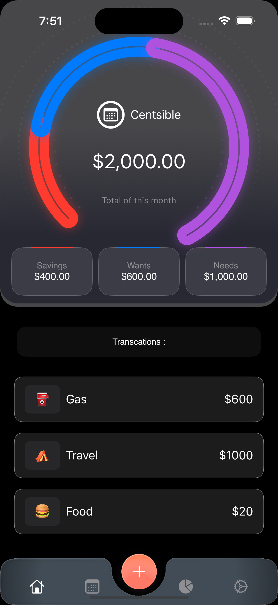
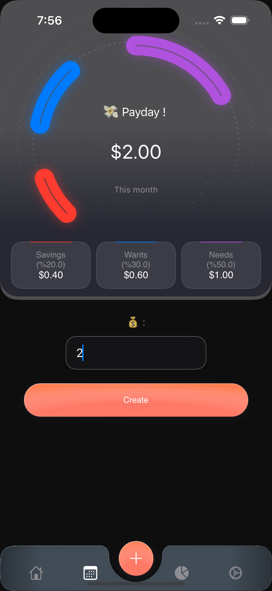
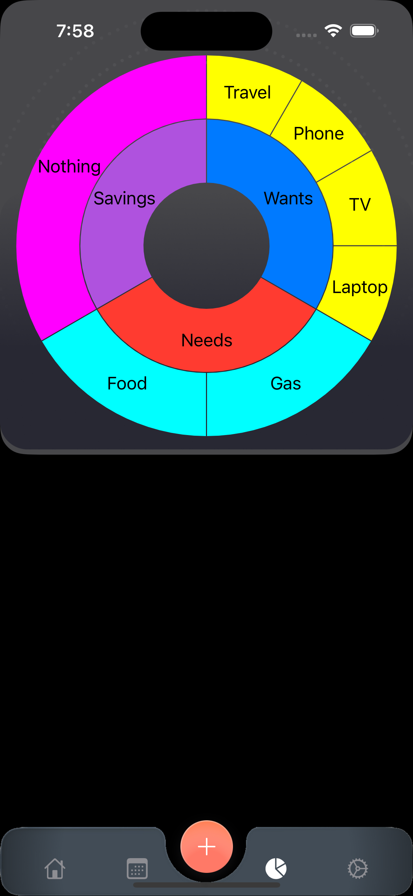
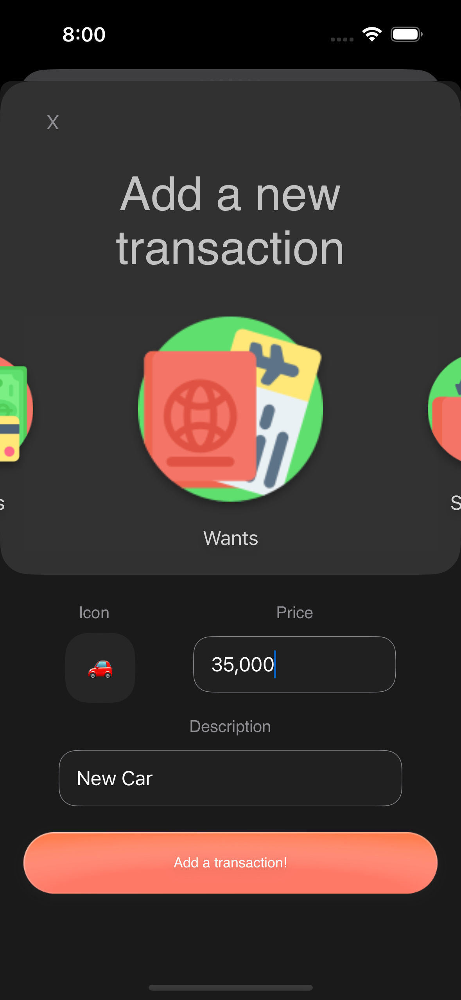

<!-- PROJECT LOGO -->
 

  

  <h3 align="center">Centsible - A budget app!</h3>

  

    (the logo is supposed to be a calculator :) )
  

<!-- ABOUT THE PROJECT -->
## About The Project

  
  

    (images from the app)
  

it's a budget app that can divide your income into three categories, spending 50% on needs, 30% on wants, and 20% on savings. 

### Built With

I used two packages that helped us to achieve our goals.

* [EmojiPicker](https://github.com/Kelvas09/EmojiPicker) -- It allows us to get a list of all the emojis as we don't have time to create our custom emoji picker
* [SwiftSunburstDiagram](https://github.com/lludo/SwiftSunburstDiagram) -- Sunburst diagram is a library written with SwiftUI to easily render diagrams given a tree of objects. 
